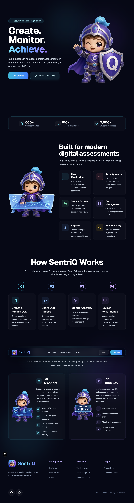
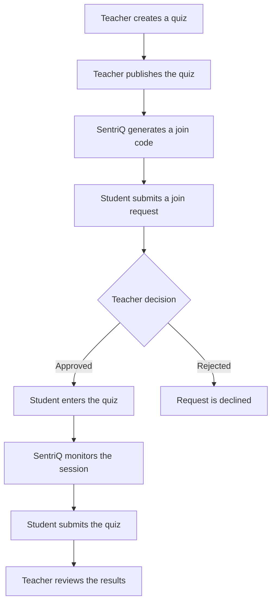

# SentriQ

### Secure Quiz Creation and Real-Time Assessment Monitoring

SentriQ helps teachers create quizzes, manage assessment sessions, monitor student activity, and review results through one secure platform.

  

## About SentriQ

SentriQ is a web-based quiz and assessment monitoring platform designed for teachers and students.

Teachers can build quizzes, publish unique join codes, approve participants, monitor live assessment sessions, and review recorded activity. Students can securely join quizzes and complete assessments through a focused quiz interface.

## Key Features

### Teacher

- Create and manage quizzes
- Build multiple-choice, identification, and true-or-false questions
- Add optional hints to questions
- Configure quiz time limits
- Generate unique quiz join codes
- Approve or reject student join requests
- Open or lock quiz joining
- Monitor student sessions in real time
- Review answers, scores, and activity timelines
- Control student access to result reports

### Student

- Join assessments using a unique quiz code
- Submit a join request for teacher approval
- Complete quizzes through a focused assessment interface
- Receive warnings when monitored activity is detected
- Submit answers automatically when the timer expires
- View quiz results when enabled by the teacher

### Administrator

- View platform statistics and recent activity
- Manage user accounts and roles
- Review quizzes and assessment sessions
- View recorded monitoring events
- Remove invalid or unnecessary records

## Assessment Monitoring

SentriQ can record relevant assessment activity, including:

- Leaving the quiz tab
- Exiting fullscreen
- Copy attempts
- Paste attempts
- Session abandonment
- Timer expiration
- Quiz completion

> Monitoring records are intended to assist teachers during assessment reviews and should be evaluated together with the complete session context.

## Technology Stack

| Category | Technology |
|---|---|
| Framework | Next.js 16 |
| User Interface | React 19 |
| Language | TypeScript |
| Styling | Tailwind CSS 4 |
| Database | Supabase PostgreSQL |
| Authentication | Supabase Auth |
| Components | shadcn/ui and Radix UI |
| Validation | Zod |
| Animation | Framer Motion |
| Security Check | Cloudflare Turnstile |
| Icons | Lucide React |
| AI Integration | Google Gemini |

## Application Workflow

## Author

**John Lester Tan**  
BS Information Technology Student

GitHub: [@jjohnlesterr](https://github.com/jjohnlesterr)

## Project Notice

SentriQ is developed for educational, portfolio, and academic assessment purposes.

Copyright © 2026 John Lester Tan.